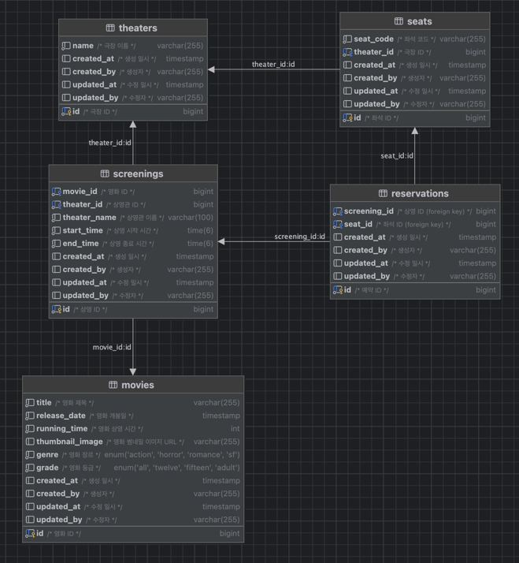
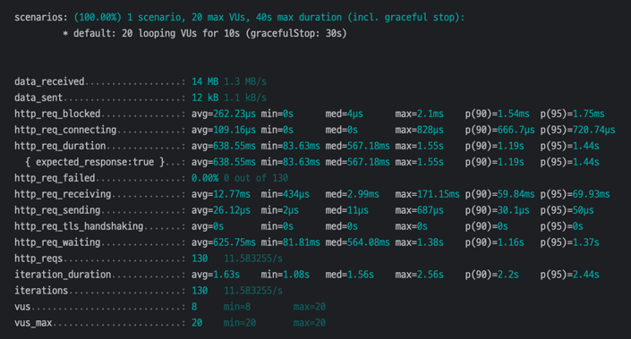
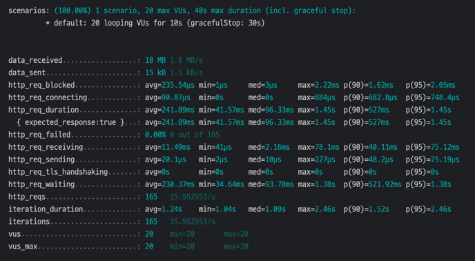
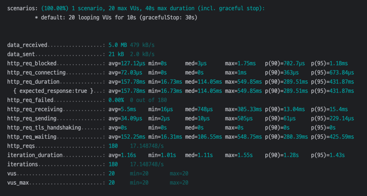
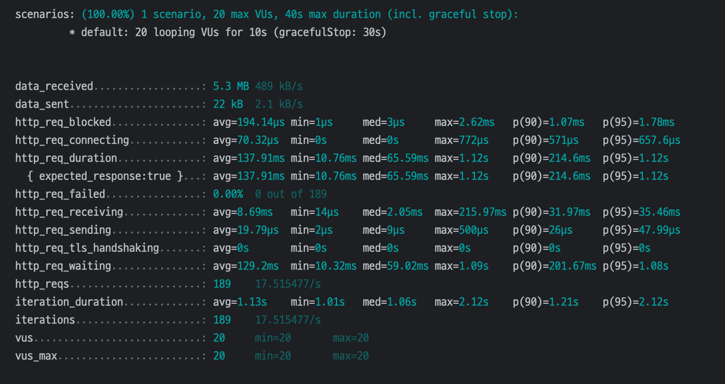
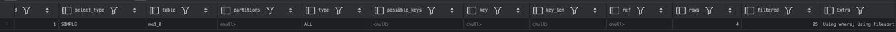
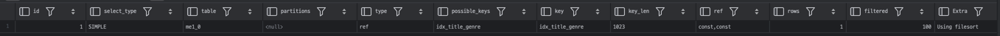
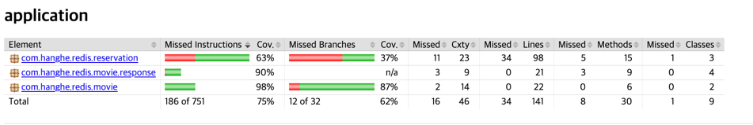
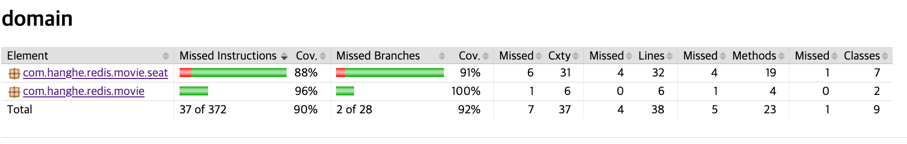

# Redis_project  

커머스의 핵심 프로세스인 상품 조회 및 주문 과정에서 발생할 수 있는 동시성 이슈 해결 및 성능 개선을 경험하고, 안정성을 높이기 위한 방법을 배웁니다.

## 1주차 시나리오
> 1주차는 프로젝트 설계(Design)에 초점을 맞췄습니다. 모듈화 및 코드 재사용성을 학습하기 위해 Multi-Module 아키텍처 기반의 시스템을 설계하고 구현하는 것과, 메인 페이지를 위한 조회 API 구현을 목표로 합니다.

### API
<details>
<summary>상영 중인 영화 조회 API</summary>
<div>

```html
GET http://localhost:8080/api/v1/movies
Accept: application/json
```

```json
{
  "responses": [
    {
      "title": "범죄도시 4",
      "grade": "15세 이상 관람가",
      "genre": "액션",
      "releaseDate": "2024-04-24T00:00:00",
      "thumbnailImage": "https://www.naver.com",
      "runningTime": 109,
      "screeningTimes": [
        {
          "theaterName": "롯데시네마",
          "startTime": "16:00:00",
          "endTime": "17:49:00"
        }
      ]
    },
    {
      "title": "어벤져스: 엔드게임",
      "grade": "12세 이상 관람가",
      "genre": "액션",
      "releaseDate": "2019-04-24T00:00:00",
      "thumbnailImage": "https://www.naver.com",
      "runningTime": 181,
      "screeningTimes": [
        {
          "theaterName": "롯데시네마",
          "startTime": "21:00:00",
          "endTime": "00:01:00"
        }
      ]
    },
    {
      "title": "인셉션",
      "grade": "15세 이상 관람가",
      "genre": "SF",
      "releaseDate": "2010-07-21T00:00:00",
      "thumbnailImage": "https://www.naver.com",
      "runningTime": 148,
      "screeningTimes": [
        {
          "theaterName": "CGV",
          "startTime": "14:30:00",
          "endTime": "17:00:00"
        },
        {
          "theaterName": "롯데시네마",
          "startTime": "14:30:00",
          "endTime": "17:00:00"
        },
        {
          "theaterName": "CGV",
          "startTime": "16:30:00",
          "endTime": "18:00:00"
        }
      ]
    }
  ]
}
```

</div>
</details>

### Multi Module
`api`
- 클라이언트의 요청 Request/Response 에 해당하는 모듈 (Controller)

`application`
- api 모듈의 요청을 받고, 비즈니스 로직을 담당하는 모듈

`common`
- 공통 모듈

`domain`
- 도메인 영역의 핵심 모듈

`infrastructure`
- 외부 영속성을 가지는 계층 (DB, HttpClient, File 등등)

### ERD


### 고민 포인트
- 상영(screenings) 테이블에 상영관의 id 뿐만 아니라 name 도 함께 설정을 하였는데, 상영 시간과 상영관 이름은 굉장히 밀접하게 호출될것으로 예상되고,
API 응답 값에도 상영관 이름이 필요하여 역정규화를 하였습니다.
- 좌석(seats) 테이블의 설계가 적합한지?
- JPA N+1 이슈로 인해 영화 조회 시 JOIN FETCH 를 적용하여 연관 관계의 데이터(상영, 극장)도 함께 가져올 수 있도록 설정합니다.

<br>

## 2주차 시나리오
> 2주차는 조회 페이지의 성능 개선에 초점을 맞췄습니다. Indexing, Caching 을 적용하면서 단계별로 성능 측정 및 성능 최적화 하는 것을 경험합니다.

### 성능 테스트 [k6 script](k6/performance.js)
https://grafana.com/docs/k6/latest/

> 테스트 환경 
> - Apple M1 Pro, 8 Core, 32GB
> - 20명의 유저가 10초 동안 요청하는 것을 기준으로 진행합니다. (delay: 1초)
> - Datasource 는 min/max poolSize 를 20으로 설정하여 진행합니다.
> - 상영중(screenings) 데이터: 약 1,500건


<details>
<summary>1. 1주차에서 구현한 API 에 대한 성능 테스트</summary>


- HTTP 요청 횟수: 130
- 평균 요청 시간: 638ms (p90: 1.19s)
- 최대 요청 시간: 1.55s

</details>

<details>
<summary>2. 2주차 요구 사항인 검색 기능을 추가하여 성능 테스트를 진행</summary>


- HTTP 요청 횟수: 165
- 평균 요청 시간: 241ms (p90: 527ms)
- 최대 요청 시간: 1.45s

</details>

<details>
<summary>3. 인덱스를 추가하고, 실행 계획을 확인하며 성능 테스트를 진행</summary>


- HTTP 요청 횟수: 180
- 평균 요청 시간: 158ms (p90: 290ms)
- 최대 요청 시간: 550ms

</details>

<details>
<summary>4~5. 캐싱 적용 후 성능 테스트를 진행</summary>


- HTTP 요청 횟수: 189
- 평균 요청 시간: 138ms (p90: 215ms)
- 최대 요청 시간: 1.12s

</details>


[k6 Built-in metrics](https://grafana.com/docs/k6/latest/using-k6/metrics/reference/)
- `http_req_duration`: 요청에 대한 총 시간
    - http_req_sending + http_req_waiting + http_req_receiving
- `http_req_sending`: 요청 데이터를 서버로 보내는 데 소요되는 시간
- `http_req_waiting`: 서버의 응답을 기다리는 시간 (서버의 처리 시간)
- `http_req_receiving`: 서버로부터 응답 데이터를 받는 데 걸린 시간
- http_reqs: k6 이 생성한 총 HTTP 요청 수

### Query Plan

```sql
explain select
            me1_0.id,
            me1_0.created_at,
            me1_0.created_by,
            me1_0.genre,
            me1_0.grade,
            me1_0.release_date,
            me1_0.running_time,
            me1_0.thumbnail_image,
            me1_0.title,
            me1_0.updated_at,
            me1_0.updated_by
        from movies me1_0
        where me1_0.title='인셉션'
          and me1_0.genre='SF'
        order by
            me1_0.release_date desc;
```

인덱스 설정이 되어있지 않았을 때,


(genre, title) 복합 인덱스 설정 후


### TODO
- gradle 의존성 최적화
- infrastructure 모듈에서 cache, mysql 등 모듈 분리
- 검색 쿼리 최적화

## 3주차 시나리오
> 3주차는 동시성 이슈 해결에 초점을 맞췄습니다. 단계별로 Lock 을 적용하고, Redisson 라이브러리에 Lua script 가 작성된 것을 확인합니다. 또한 성능 최적화를 위해 AOP 분산락에서 함수형 분산락을 적용하는 경험을 합니다. 

- [X] 예약 API 구현
- [X] Pessimistic Lock 구현
- [X] Optimistic Lock 구현
- [ ] AOP 기반 Distributed Lock 구현
- [ ] 함수형 기반 Distributed Lock 구현

## 4주차 시나리오
> 4주차는 무분별한 요청으로 인한 서버 과부하나 악의적인 공격을 방지하여 서버의 안정성을 높이기 위한 `RateLimit` 을 구현합니다.
> 또한 테스트 코드를 작성하여 커버리지를 측정하고, 리팩토링을 진행합니다.

- [X] 조회 API RateLimit 적용 - 1분 내 50회 이상 요청 시 1시간 동안 해당 IP 차단
- [X] 조회 API RateLimit 을 Lua Script 를 작성하여 적용
- [X] 예약 API RateLimit 적용 - 유저당 같은 시간대의 영화는 5분에 최대 1번 예약 가능
- [ ] 통합 테스트 작성

### Test Coverage
#### application 모듈


#### domain 모듈
> domain 모듈의 Entity 는 생성자/getter 등의 커버리지로 인해 exclude 처리 하였습니다.



### 리팩터링
- 부분적인 네이밍 개선
- infra 모듈 분리 (cache, message, mysql, ratelimiter)
